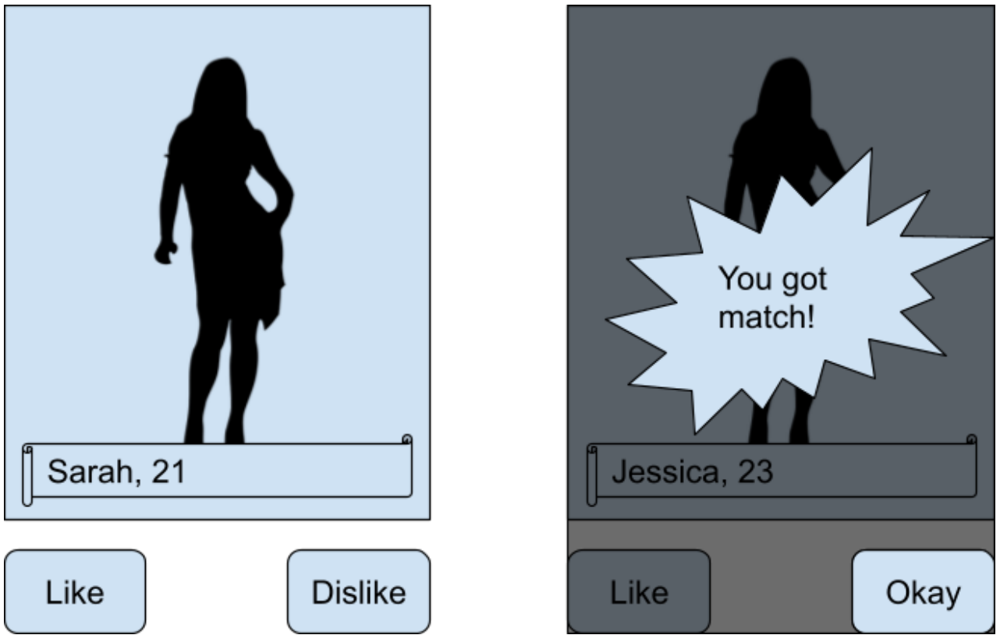

# Test assignment for Angular developer

Needs to implement a fully tested and production ready prototype of a Tinder-like application.
The Okay button leads a user “swiping” further.
Needs only the like-dislike part of the app -- registration, profiles, etc must be skipped.

### Design



### Requirements

0. The client-backend communication contract must be provided by you in a readme file. 
0. Angular material must be used 
0. Errors and borderline cases must be taken into account 
0. The test assignment must be production ready 
0. Unit and e2e tests must be provided

### Matches interface:

```json
{
  "matches": [
    {
      "id": "1",
      "title": "Dog#1",
      "subtitle": "Dog Breed",
      "content": "The Shiba Inu is the smallest of the six original and distinct spitzbreeds of dog from Japan. A small, agile dog that copes very wellwith mountainous terrain, the Shiba Inu was originally bred forhunting.",
      "img": {
        "src": "https://material.angular.io/assets/img/examples/shiba2.jpg",
        "alt": "Photo of a Shiba Inu"
      }
    },
    {
      "id": "2",
      "title": "Dog#2",
      "subtitle": "Dog Breed",
      "content": "The Shiba Inu is the smallest of the six original and distinct spitzbreeds of dog from Japan. A small, agile dog that copes very wellwith mountainous terrain, the Shiba Inu was originally bred forhunting.",
      "img": {
        "src": "https://material.angular.io/assets/img/examples/shiba2.jpg",
        "alt": "Photo of a Shiba Inu"
      }
    },
    {
      "id": "3",
      "title": "Dog#3",
      "subtitle": "Dog Breed",
      "content": "The Shiba Inu is the smallest of the six original and distinct spitzbreeds of dog from Japan. A small, agile dog that copes very wellwith mountainous terrain, the Shiba Inu was originally bred forhunting.",
      "img": {
        "src": "https://material.angular.io/assets/img/examples/shiba2.jpg",
        "alt": "Photo of a Shiba Inu"
      }
    }
  ]
}
```
